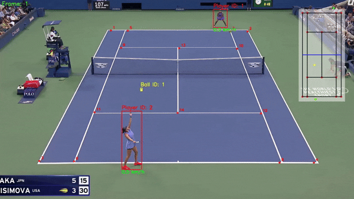
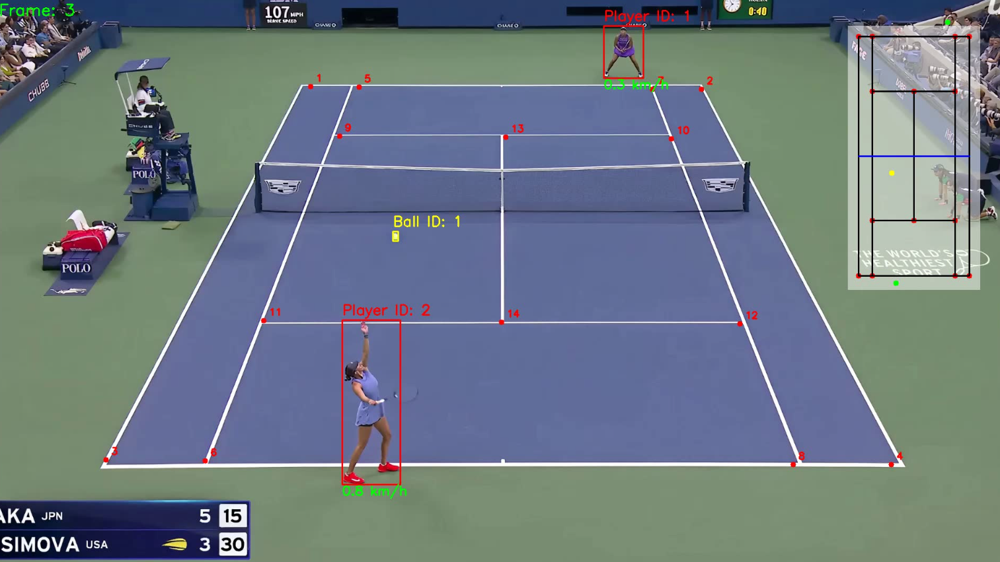
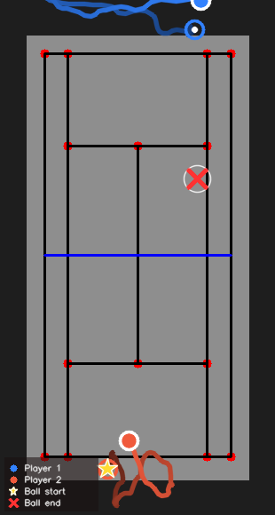
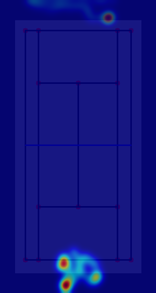

# 🎾 Tennis Rally Analytics — Computer Vision-Based System for Tennis Match Analysis

> Le Duc Tuyen | Hung Yen University of Technology and Education
> Major: Artificial Intelligence and Data Science | Supervisor: Trung-Hieu Le, PhD

---

## 🖼️ Demo


| Output Video | Trajectory Map | Heatmap |
|:---:|:---:|:---:|
|  |  |  |

---

## 📌 Overview

**Tennis Rally Analytics** is a complete end-to-end computer vision system that automatically analyzes tennis match videos from broadcast footage. It detects and tracks players and the ball, maps their positions onto a top-down mini court view, estimates speed, generates movement heatmaps, produces trajectory maps, and delivers actionable tactical insights — all wrapped in an interactive Streamlit web application.

The system is designed to be a practical coaching tool, providing coaches and analysts with per-rally statistics that go well beyond simple detection and tracking.

---

## 🎯 Key Features

| Feature | Description |
|---|---|
| 🧍 **Player Detection & Tracking** | YOLO11m + polygon-based court filtering to isolate the 2 main players from ball boys and line judges |
| 🎾 **Ball Detection & Tracking** | YOLO26m for high-recall small-object detection with interpolation for missed frames |
| 🏟️ **Court Keypoint Detection** | ResNet50 predicts 14 court keypoints (NME = 1.007%) for accurate spatial mapping |
| 🗺️ **Mini Court Visualization** | Homography transformation projects real positions to a top-down court view |
| ⚡ **Speed Estimation** | Per-player speed (km/h), peak speed, average speed, and sprint count |
| 🔥 **Movement Heatmap** | Gaussian density map showing where each player spent the most time |
| 📍 **Trajectory Map** | Color-gradient path visualization with start/end markers for both players |
| 📊 **Rally-Level Analytics** | Distance, court coverage (m²), movement ratio, position style, ball end zone |
| 💬 **Auto Insights** | Rule-based engine generates natural-language tactical observations |
| 📄 **PDF Report** | One-page coaching report (ReportLab) downloadable directly from the app |

---

## 🏗️ System Architecture

```
Input Video (.mp4 / .avi)
        │
        ▼
┌─────────────────────────────────────────────────┐
│                 Detection Layer                  │
│  YOLO11m (Players) │ YOLO26m (Ball)              │
│  ResNet50 (Court Keypoints — 14 points)         │
└──────────────────┬──────────────────────────────┘
                   │
                   ▼
┌─────────────────────────────────────────────────┐
│              Spatial Mapping Layer               │
│  Polygon Filtering → Player Selection           │
│  Homography Transform → Mini Court (top-down)   │
│  Trajectory Smoothing (moving average, w=5)     │
└──────────────────┬──────────────────────────────┘
                   │
                   ▼
┌─────────────────────────────────────────────────┐
│              Analytics Layer                     │
│  Speed Estimator │ Rally Analyzer               │
│  Sprint Detection │ Coverage Area (ConvexHull)  │
│  Heatmap Generator │ Trajectory Map              │
│  Insight Generator (rule-based)                 │
└──────────────────┬──────────────────────────────┘
                   │
                   ▼
┌─────────────────────────────────────────────────┐
│              Output Layer                        │
│  Annotated Video │ Heatmap PNG │ Trajectory PNG  │
│  PDF Report │ Streamlit Web App                  │
└─────────────────────────────────────────────────┘
```

---

## 📁 Project Structure

```
tennis-rally-analytics/
│
├── app.py                        # Streamlit web application (main entry)
├── main.py                       # Standalone pipeline runner
├── requirements.txt              # Python dependencies
├── demo/                         # Demo images for README
│   ├── output_preview.png
│   ├── trajectory.png
│   └── heatmap.png
│
├── constants/
│   └── __init__.py               # Court dimensions (meters), player heights
│
├── trackers/
│   ├── player_tracker.py         # YOLO tracking + polygon filtering
│   └── ball_tracker.py           # Ball detection, interpolation, shot detection
│
├── court_line_detector/
│   └── court_line_detector.py    # ResNet50-based keypoint predictor
│
├── mini_court/
│   └── mini_court.py             # Homography mapping + mini court drawing
│
├── speed_estimator/
│   └── speed_estimator.py        # Per-player speed calculation + rendering
│
├── heatmap/
│   └── heatmap_generator.py      # Gaussian heatmap + overlay
│
├── trajectory/
│   └── trajectory_map.py         # Gradient polyline + marker visualization
│
├── rally_analysis/
│   └── rally_analyzer.py         # Rally metrics + auto insight generation
│
├── report/
│   └── pdf_generator.py          # ReportLab one-page PDF report
│
├── utils/
│   ├── video_utils.py            # read_video / save_video (OpenCV)
│   ├── bbox_utils.py             # Bounding box helpers
│   ├── conversions.py            # Pixel ↔ meter conversions
│   └── smoothing.py              # Moving-average trajectory smoother
│
├── analysis/
│   └── ball_analysis.ipynb       # Ball hit detection notebook
│
├── models/                       # Trained model weights (not tracked in git)
├── tracker_stubs/                # Cached .pkl detections for fast re-runs
└── output_videos/                # Per-video output folder (not tracked in git)
```

> 📝 **Note:** The folders `models/`, `input_videos/`, `output_videos/`, and `tracker_stubs/` are not pushed to GitHub. You need to create them manually after cloning.

---

## 🤖 Model Selection

### Ball Detection (YOLO variants, 100 epochs)

| Model | mAP@50 | mAP@50-95 | Recall | FPS | Selected |
|---|---|---|---|---|---|
| YOLOv8m | 0.8788 | 0.5633 | 0.8205 | 62.5 | |
| YOLO11m | 0.8729 | 0.5506 | 0.8000 | 59.0 | |
| YOLO12m | 0.8194 | 0.4820 | 0.8262 | 50.9 | |
| **YOLO26m** | **0.8991** | **0.5968** | **0.8556** | **59.6** | **✓** |

### Player Detection (YOLO variants, 100 epochs)

| Model | mAP@50 | mAP@50-95 | Recall | FPS | Selected |
|---|---|---|---|---|---|
| YOLOv8m | 0.9945 | 0.8118 | 0.9858 | 40.5 | |
| **YOLO11m** | **0.9946** | **0.8094** | **0.9894** | **40.7** | **✓** |
| YOLO12m | 0.9943 | 0.7698 | 0.9894 | 31.1 | |
| YOLO26m | 0.9943 | 0.7952 | 0.9771 | 39.5 | |

### Court Keypoint Detection (CNN backbones)

| Model | Mean Distance (px) | NME (%) | Params (M) | Selected |
|---|---|---|---|---|
| **ResNet50** | **7.40** | **1.007** | **24.6** | **✓** |
| EfficientNet-B5 | 14.90 | 2.029 | 29.4 | |
| ConvNeXt-Small | 29.52 | 4.020 | 49.9 | |

---

## 🚀 Getting Started

### Prerequisites

- Python **3.10** (recommended — tested on this version)
- CUDA 11.8 (optional, for GPU acceleration)
- FFmpeg (for AVI → MP4 video conversion)

### Step 1 — Clone the repository

```bash
git clone https://github.com/<your-username>/tennis-rally-analytics.git
cd tennis-rally-analytics
```

### Step 2 — Create and activate virtual environment

```bash
# Create
python -m venv env

# Activate — Windows
env\Scripts\activate

# Activate — Mac/Linux
source env/bin/activate
```

### Step 3 — Install PyTorch (choose one)

```bash
# If you have NVIDIA GPU with CUDA 11.8 (recommended)
pip install torch==2.7.1+cu118 torchvision==0.22.1+cu118 --index-url https://download.pytorch.org/whl/cu118

# If CPU only
pip install torch torchvision
```

### Step 4 — Install remaining dependencies

```bash
pip install -r requirements.txt
```

### Step 5 — Download Model Weights

Download trained model weights from Google Drive:

> 🔗 **[Download models here](https://drive.google.com/your-link-here)**

Place the downloaded files into the `models/` directory:

```
models/
├── yolo26m_best_100e.pt      # Ball detection (YOLO26m)
├── yolo26x.pt                # Player detection (YOLO11m)
└── keypoints_model_04.pth    # Court keypoint detection (ResNet50)
```

### Step 6 — Create required folders

```bash
mkdir input_videos
mkdir output_videos
mkdir tracker_stubs
```

---

## ▶️ Running the App

### Web Application (Streamlit)

```bash
streamlit run app.py
```

Then open `http://localhost:8501` in your browser.

### CLI Pipeline

```bash
python main.py
```

Edit `number_of_vid` inside `main.py` to point to your input video file.

---

## 🖥️ Web Application

The Streamlit app provides a fully interactive interface:

- **Sidebar** — Upload video, set detection confidence, enable polygon filtering, download PDF report
- **Tab 1: Output Video** — Annotated video + speed cards (avg/peak) + shot count + total distance + advanced stats
- **Tab 2: Trajectory Map** — Color-gradient movement paths with start/end markers for both players
- **Tab 3: Player Heatmap** — Gaussian density overlay on the mini court
- **Tab 4: Rally Insights** — Performance comparison table + auto-generated tactical observations

> ⚡ **Stub caching** (`.pkl` files) is used to skip YOLO inference on repeated runs, significantly reducing processing time for the same video.

---

## 📊 Analytics Metrics

For each rally the system computes:

| Metric | Description |
|---|---|
| **Distance (m)** | Total distance traveled by each player |
| **Peak Speed (km/h)** | Maximum instantaneous speed |
| **Avg Speed (km/h)** | Mean speed across all frames |
| **Sprint Count** | Number of continuous high-speed bursts (> 20 km/h, ≥ 4 frames) |
| **Court Coverage (m²)** | Area of the convex hull of all positions |
| **Movement Ratio** | Distance ratio between the two players |
| **Position Style** | Attacking / Neutral / Defensive (baseline offset) |
| **Ball End Zone** | 1 of 6 zones where the rally ended |

Auto-generated insights translate these numbers into natural-language sentences for coaches (e.g., *"Player 2 was heavily pressured — ran 2.3× more than the opponent"*).

---

## 📈 Results

The complete integrated system was evaluated on multiple real tennis match broadcast videos. Highlights:

- Both players reliably tracked throughout rallies, including during occlusion
- Correct mini-court mapping in most standard camera angles
- Movement heatmap accurately reflects each player's court zone
- Speed estimates consistent with expected professional tennis movement patterns
- Automatic insights match manual coaching observations for tested rallies

**Known limitations:**
- Occasional ball misdetection under heavy motion blur
- Small homography errors at extreme camera angles
- Speed inaccuracy near court edges

---

## 🔮 Future Work

- Replace ball tracker with a temporal-aware model (e.g., **TrackNet**)
- Add temporal smoothing for court keypoints to reduce inter-frame jitter
- Implement **shot-type classification** (forehand, backhand, serve, volley)
- Add **player pose estimation** for biomechanical analysis
- Extend to other racket sports (badminton, table tennis)

---

## 📚 References

- YOLO series — Ultralytics (YOLOv8 / YOLO11 / YOLO12 / YOLO26)
- He et al. (2016) — Deep Residual Learning for Image Recognition (ResNet)
- Hartley & Zisserman (2003) — Multiple View Geometry in Computer Vision
- Tan & Le (2019) — EfficientNet
- Liu et al. (2022) — ConvNeXt
- Datasets from Roboflow Universe & yastrebksv/TennisCourtDetector

Full reference list is available in the thesis document.

---

## 👤 Author

**Le Duc Tuyen**
Department of Computer Science — Faculty of Information Technology
Hung Yen University of Technology and Education
Supervisor: **Trung-Hieu Le, PhD**

---

## 📄 License

This project is developed as a graduation thesis. Please contact the author before using it for commercial purposes.
